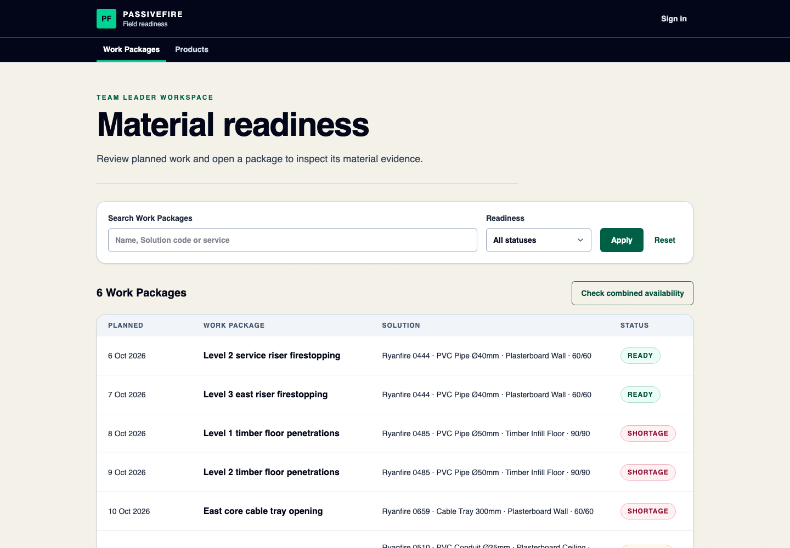
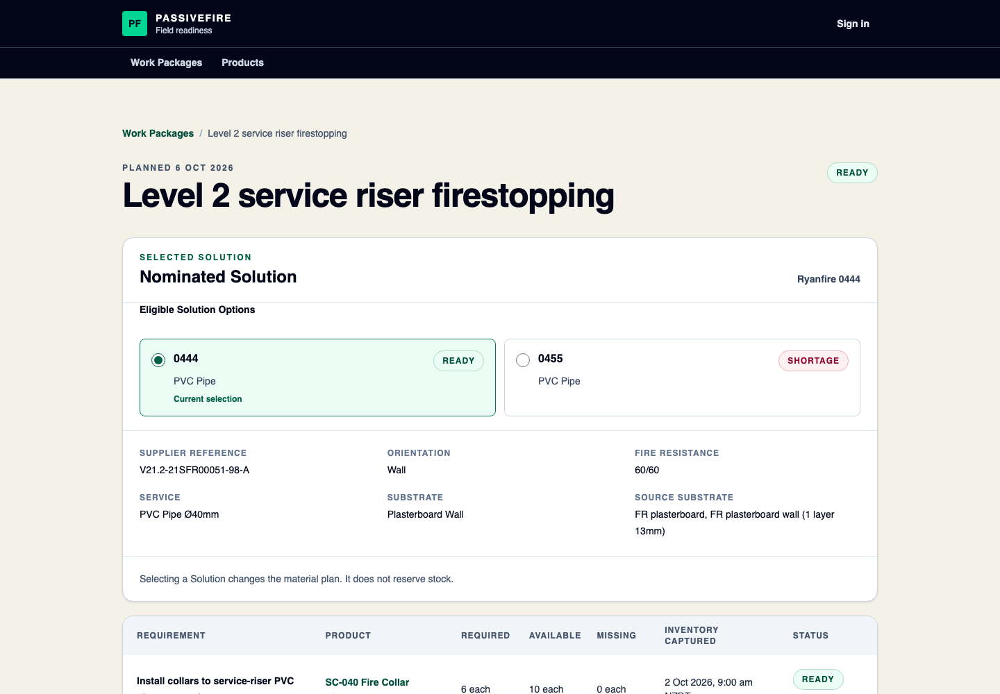
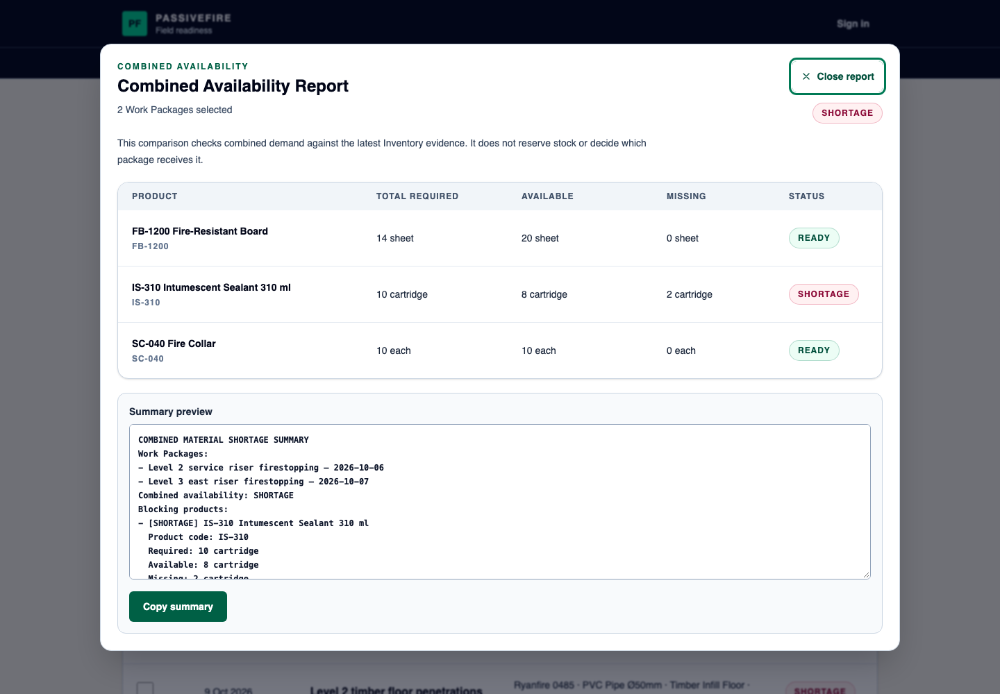

# Passivefire Material Readiness

A focused QAntum take-home slice for a passive-fire Team Leader: check whether
planned Work Packages have the required Products, compare shared demand, and
prepare a Shortage Summary before travelling to site.

[Open the public demo](https://qantum-stock.vercel.app/) ·
[View CI](https://github.com/jiqiang90/qantum-stock/actions/workflows/ci.yml) ·
[View deployments](https://github.com/jiqiang90/qantum-stock/actions/workflows/deploy.yml)

## What you can try

The public experience is read-only. A pre-provisioned Demo Team Leader can sign
in to change the nominated Solution; credentials are shared privately and are
not stored in this repository.

1. Open **Work Packages** and filter planned work by name, Solution, service, or
   readiness status.
2. Open a Work Package to compare its eligible Solutions and inspect the
   resulting Product Requirements.
3. Choose **Check combined availability**, select at least two Work Packages,
   and compare their total demand with shared Inventory evidence.
4. Open a package with a shortage to prepare and copy a deterministic Shortage
   Summary.
5. Open **Products** to search the Product catalogue, review Inventory evidence,
   and see which Work Packages use a Product.

`READY`, `SHORTAGE`, and `UNKNOWN` describe the available evidence only. The
application does not reserve stock, approve a fire-stopping Solution, or decide
which Work Package receives constrained stock.

## Product walkthrough

### Review planned work

The Work Package list keeps individual readiness visible and provides a
separate entry into the combined-demand workflow.

<p align="center">
  
</p>

### Understand the nominated Solution

A Work Package connects its selected Solution to the Product Requirements used
for the readiness calculation. Public visitors can preview another eligible
Solution; signing in is required to persist the change.

<p align="center">
  
</p>

### Check shared Inventory pressure

Combined Availability groups demand by Product and counts the latest Inventory
evidence once. In this scenario, two individually ready Work Packages require
ten sealant cartridges together, while only eight are available.

<p align="center">
  
</p>

## Scope and data

The supplied Ryanfire CSV is a **Solutions catalogue**, not an operational
inventory system. The versioned seed preserves twelve selected Solution records
from it. Work Packages, Products, Solution-to-Product mappings, required
quantities, and Inventory Snapshots are synthetic assumptions introduced for
this demonstration.

The implemented slice includes:

- public Work Package, Solution, Product Requirement, Inventory, and Product
  evidence;
- authenticated selection of an eligible Solution;
- single-package and combined Material Readiness;
- copyable single-package and combined Shortage Summaries; and
- Product search, filters, details, and reverse Work Package usage.

It deliberately excludes reservations, allocations, purchasing, delivery
dates, notifications, persistent reports, production RBAC/tenancy, Product
administration, and compliance approval of alternative Solutions.

## Architecture

- **Application:** Next.js modular monolith with route adapters, capability
  services, repository ports, and pure readiness calculations.
- **Data and auth:** Supabase Postgres, Row Level Security, and bounded Supabase
  Auth for the demonstrated write.
- **Frontend:** React Server Components with small client components only where
  browser state or clipboard access is required.
- **Delivery:** GitHub Actions runs the quality gate, then deploys the verified
  revision to Vercel through a separate production workflow.

See the [technical overview](docs/architecture/overview.md) for the component,
data-flow, security, and trade-off details.

## Run locally

Use Node.js 22.22.0 (recorded in `.nvmrc`) and npm 10.9.4.

```bash
nvm use # optional
npm ci
cp .env.example .env.local
npm run db:start
npm run db:reset
npm run dev
```

Populate `.env.local` with the local Supabase URL and publishable key printed by
the local stack, then open `http://localhost:3000`. Docker is required for local
Supabase. No service-role key is required by the application.

Useful database commands:

```bash
npm run db:test
npm run db:types # after a schema change
npm run db:stop
```

## Verify the project

```bash
npm run check   # format, lint, typecheck, full-source coverage, production build
npm run db:reset
npm run db:test # RLS, command permissions, schema and seed behaviour
npm run auth:provision-local
PLAYWRIGHT_WEB_SERVER_COMMAND="npm run start" npm run test:e2e
```

The authenticated browser journey also needs the local-only `SUPABASE_URL`,
`SUPABASE_SERVICE_ROLE_KEY`, `E2E_TEAM_LEADER_EMAIL`, and
`E2E_TEAM_LEADER_PASSWORD` entries in `.env.local`. Run
`npm run auth:provision-local` after a database reset. Missing credentials skip
that journey locally and fail CI; the provisioning command rejects non-local
Supabase hosts.

When port 3000 is already in use, set `PLAYWRIGHT_BASE_URL` to a free local
origin and pass the matching port to `PLAYWRIGHT_WEB_SERVER_COMMAND`. An
explicit production-server command never reuses an existing development server.

GitHub `CI` starts a clean local Supabase stack, resets and tests the database,
runs `npm run check`, and then executes Playwright against the production build.
After CI succeeds on `main`, the separate `Deploy` workflow deploys that exact
revision to Vercel; it can also be started manually. CI, deployment, and public
runtime verification remain separate evidence.

## Documentation

Start with the compact [documentation guide](docs/README.md). The main review
path is:

1. [Product overview](docs/product/overview.md)
2. [First Slice specification](docs/specs/material-readiness.md)
3. [Solution-selection extension](docs/specs/solution-selection.md)
4. [Technical architecture](docs/architecture/overview.md)
5. [Test strategy](docs/quality/test-strategy.md)
6. [Agent-assisted approach](docs/engineering/agent-approach.md)

Execution status and verification evidence live under [`tasks/`](tasks/), not
in the stable product and architecture documents.
