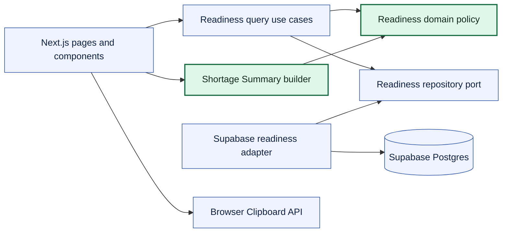
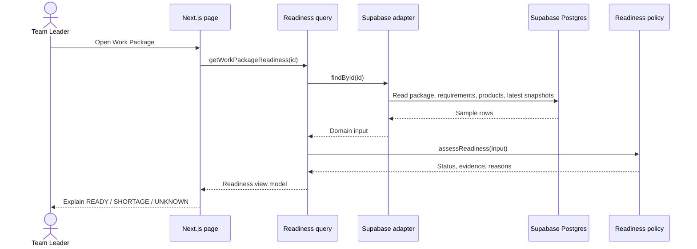
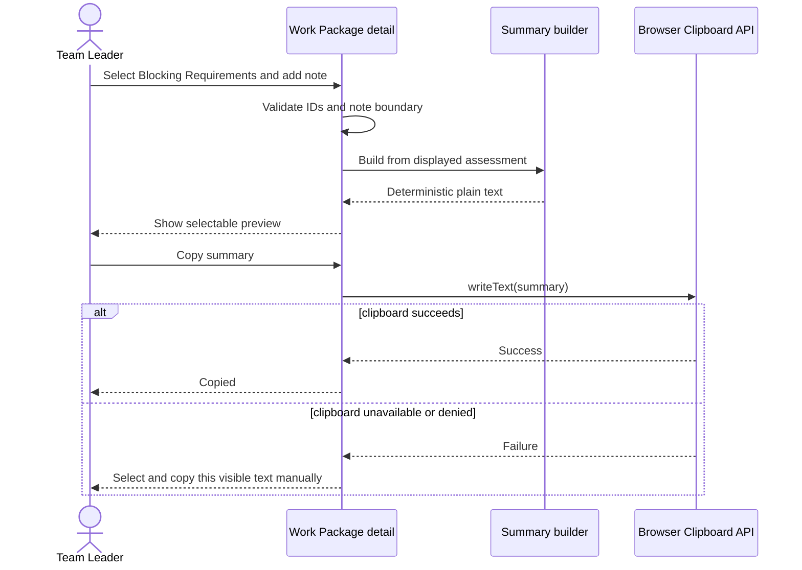
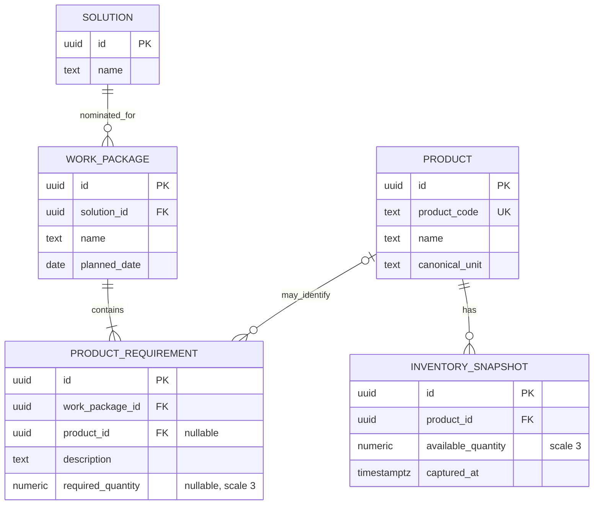

# First Slice Technical Design

## Architectural focus

The architecture exists to support one journey: read Work Package evidence,
calculate Material Readiness, prepare a Shortage Summary, and copy it. It is a
Next.js modular monolith with Supabase Postgres as a replaceable read-only data
source.

No authentication, persistence command, notification, queue, second service, or
generic framework is justified by A2.

## Module boundaries

- **Domain:** framework-independent readiness types, rules, reasons, and
  invariants.
- **Application:** list/detail queries and a small capability-specific
  repository port.
- **Infrastructure:** Supabase query and row-to-domain translation.
- **Presentation:** pages, interaction state, boundary validation, summary
  preview, and clipboard feedback.
- **Shortage Summary builder:** a pure function; it needs no repository or class
  because it has no I/O, identity, or lifecycle.

Dependencies point inward. Domain and application code do not import React,
Next.js request/response types, or Supabase. A layer must own policy,
orchestration, translation, or external integration; pass-through layers are not
kept.

## Readiness data flow

The adapter chooses the latest Inventory Snapshot deterministically by
`captured_at DESC, id DESC`. Inventory evidence is joined through the mapped
Product; an unmapped requirement cannot expose an orphan available quantity or
snapshot time. Missing data remains missing; `0` remains numeric evidence.

## Shortage Summary flow

This flow performs no server mutation. The UI must not claim that the summary
was sent, reported, escalated, received, or resolved.

## Minimal data model

The one nominated Solution per Work Package is a demo assumption, not a claim
about the production planning model. Each Product represents a concrete
stock-tracked item with a unique synthetic `product_code` and specific name;
generic material descriptions and units are not Product identities. Supplied
Solution `Internal Code` and `Supplier Ref. Code` values are never reused as
Product Codes. `ProductRequirement.product_id` and `required_quantity` are
nullable so the demo can explain `UNKNOWN`. Requirement and inventory rows do
not repeat units; both quantities use the Product's canonical unit. Persisted
quantities use `numeric(12,3)` and domain arithmetic normalizes to the same
three-decimal scale.

There is no row-level `sample_data` flag because every runtime row in this demo
is synthetic. A global Sample Data notice carries that meaning. There is no
`source_reference` field because the First Slice has no real provenance source
or consumer for it.

## Read-only security boundary

- Application runtime uses only the Supabase URL and publishable key.
- The public database role can select only the tables/views required by the
  demo; it cannot insert, update, delete, execute a privileged write function,
  or inspect unrelated schemas.
- No service-role key is present in browser, server runtime, CI logs, or source.
- Server-side query code narrows results and maps database rows into domain
  input. Database errors are translated before reaching the public UI.
- Clipboard content is user-visible before copying. The application does not
  read existing clipboard contents.

This is proportionate protection for synthetic public demo data. It is not a
production authorization or tenancy model.

## Important failure states

| Failure                                    | User-visible treatment                       |
| ------------------------------------------ | -------------------------------------------- |
| Supabase unavailable                       | Dependency error; never infer `READY`        |
| Work Package missing                       | Explicit not-found state                     |
| Product, demand, or inventory missing      | `UNKNOWN` with a specific reason             |
| Invalid or unrelated blocker selection     | Validation error; no summary is produced     |
| Clipboard unavailable or permission denied | Selectable summary plus manual-copy guidance |

## Deliberate extension path

If QAntum validates the assumed construction-project responsibility model, a
future
[`Material Shortage Notice`](../specs/future/material-shortage-notice.md)
capability can route the issue to the Work Package's Project Manager. That role
would coordinate Stores or Procurement, independent Alternative-Solution review,
and a concrete Action Plan for the Team Leader.

The future capability may add authentication, authorization, command handling,
transactional storage, assignment, notification, and audit history while
consuming the existing readiness evidence. No unused port, table, route, or
placeholder is created now.

Other Production Gaps remain live inventory semantics, multiple locations,
reservation, unit conversion, Alternative-Solution approval, scheduling, and
offline synchronization.
