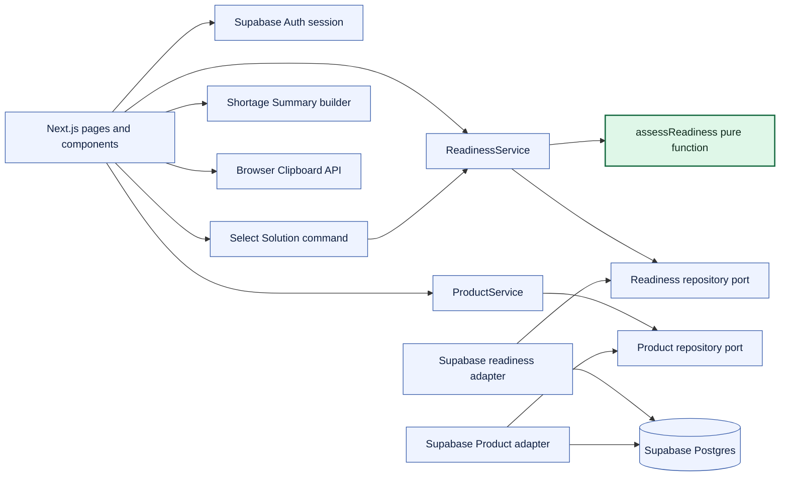
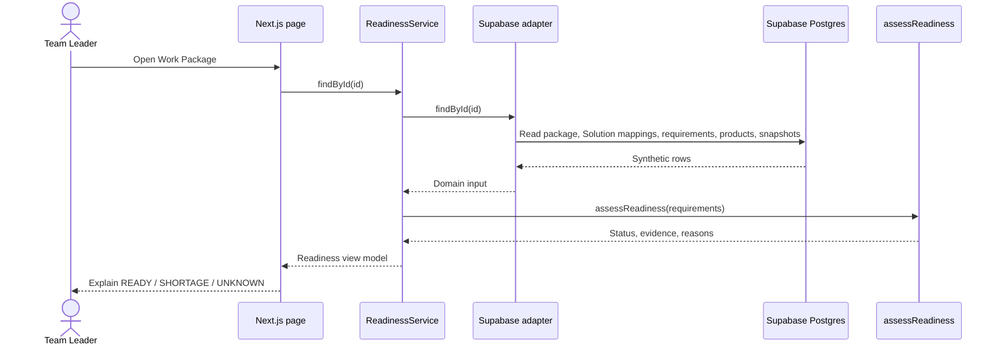
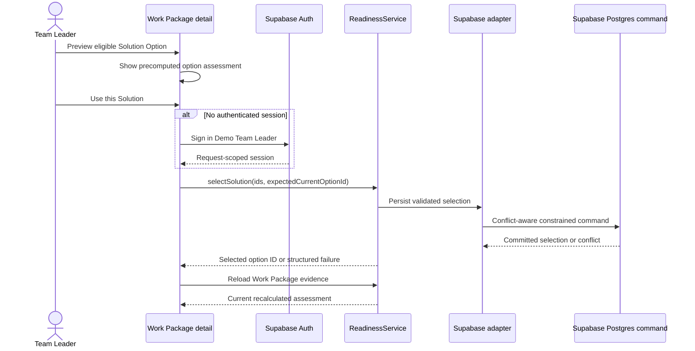
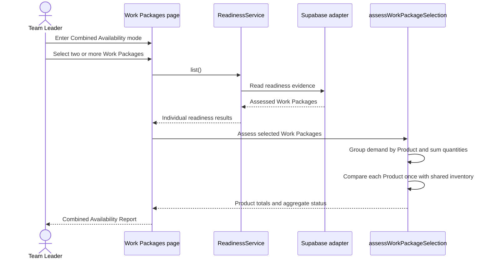
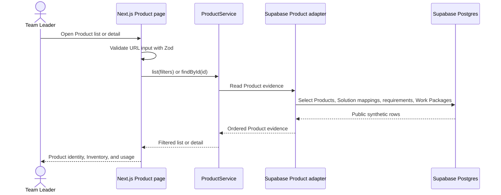
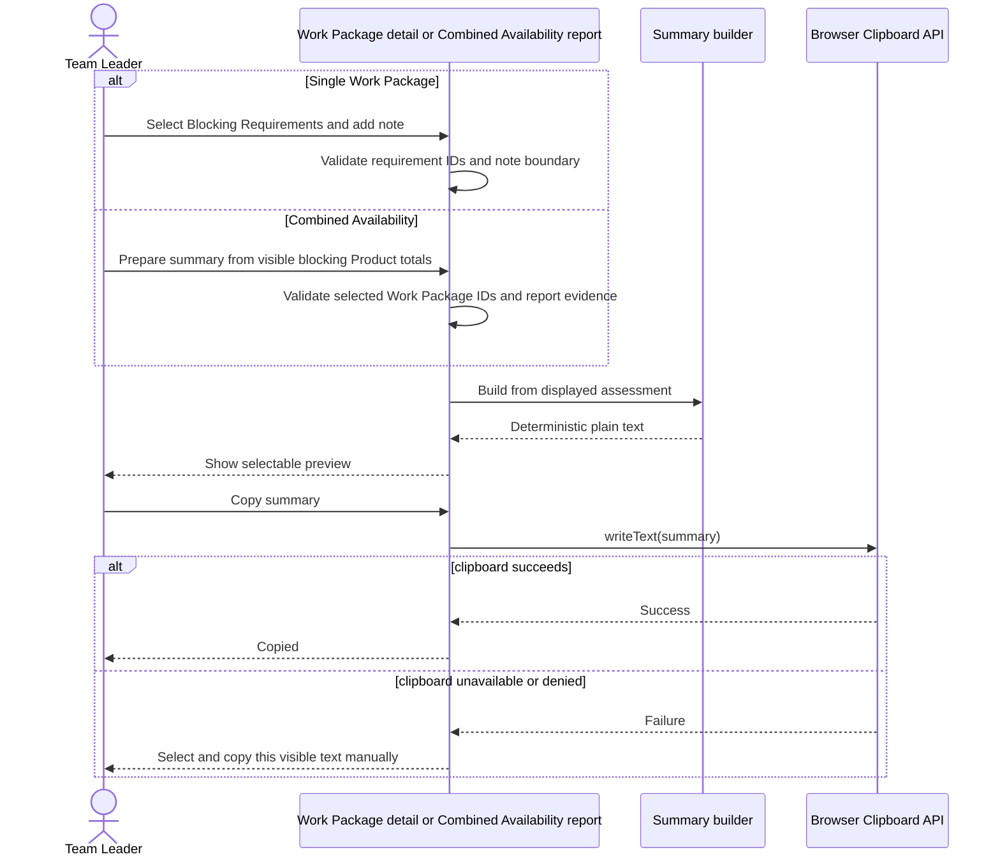
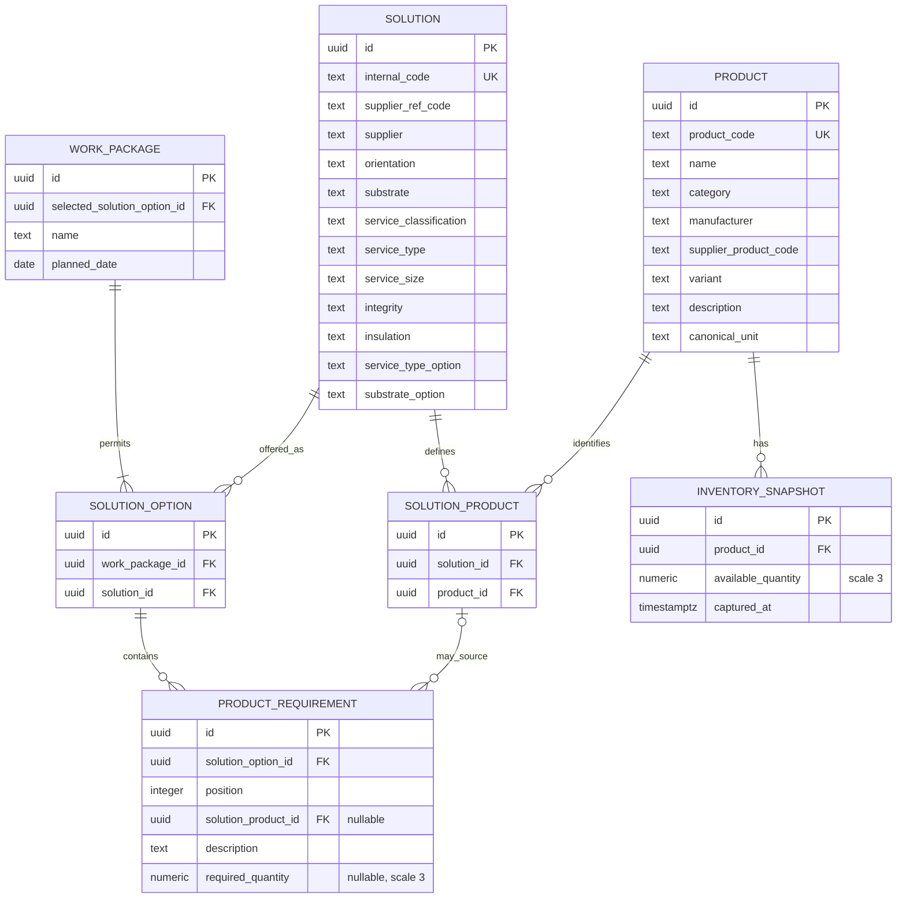

# First Slice Technical Design

## Architectural focus

The implemented architecture supports Work Package and Product discovery,
individual and aggregate Material Readiness, eligible Solution preview, and an
authenticated selected-Solution write. Aggregate Readiness is presented through
an explicit Combined Availability mode on the Work Packages page rather than
permanent selection controls in its default state. It is a Next.js modular
monolith with Supabase Postgres and Auth as runtime dependencies.

Copyable single-package and combined Shortage Summaries are implemented as
transient browser interactions. Production identity and authorization,
reservation, notification, queue, second service, and generic frameworks remain
unjustified.

## Module boundaries

- **Readiness module:** a flat capability module containing framework-independent
  models and rules, `ReadinessService`, its small repository port, the Supabase
  adapter, and focused list/detail components. It also owns Solution-option
  preview and the bounded selection operation.
- **Product module:** a flat read-only capability containing Product evidence,
  `ProductService`, its small repository port, the Supabase adapter, URL filter
  boundaries, and focused list/detail components. Reverse usage traverses the
  Solution-required Product mapping without presenting Solution compliance.
- **Next.js app:** route/controller adapters, interaction state, boundary
  validation, loading/not-found/error handling, and page composition.
- **Shortage Summary builder:** pure functions with no repository or class
  because summary composition has no I/O, identity, or lifecycle. The builders
  consume already-calculated readiness assessments; they do not invoke the
  readiness rules. Clipboard I/O remains inside a focused client component.

Dependencies point from routes to the capability service and from the service to
pure rules and the repository port. The Supabase adapter owns database
translation. Pure business code does not import React, Next.js request/response
types, or Supabase. A file must own policy, orchestration, translation, external
integration, or focused presentation; pass-through layers are not kept.

## Service and constructor-injection boundary

`ReadinessService` exposes list, detail, and selection operations. It receives the
`ReadinessRepository` through explicit constructor injection, then applies the
pure `assessReadiness` function to the returned evidence. Its tests use a
controlled repository to prove orchestration without a dependency-injection
framework.

`ProductService` follows the same constructor-injection boundary for Product
list/detail operations. It owns search, evidence filtering, deterministic
ordering, and the unique referencing-Work-Package count. Its Supabase adapter
owns row translation, latest-snapshot selection, and ordered requirement usage.

The First Slice has one verified `READY`, `SHORTAGE`, and `UNKNOWN` algorithm.
Changing the selected Solution changes its input requirements, not the
algorithm. A future reservation-aware calculation needs trusted reservation
data and ownership semantics. Until those exist, it remains a Production Gap
rather than a plugin or executable Strategy.

## Readiness data flow

The adapter chooses the latest Inventory Snapshot deterministically by
`captured_at DESC, id DESC`. Inventory evidence is joined through the mapped
Product; an unmapped requirement cannot expose an orphan available quantity or
snapshot time. Missing data remains missing; `0` remains numeric evidence.

## Selected Solution write flow

Association with the Work Package makes a Solution selectable. This eligibility
is synthetic operational data, not a conclusion derived from catalogue fields.
The command changes only the selected option and does not reserve inventory.
Its detailed contract and target data model are defined in the
[`Scenario Solution Selection specification`](../specs/solution-selection.md).

## Selected Work Package aggregate flow

The Combined Availability Check is a transient comparison over the explicitly
selected Work Packages. The default page state remains a browsing surface
without checkboxes. `Check combined availability` switches that page into a
validated multi-select mode; leaving the mode clears selection and restores the
browse-only state.
The calculated report is a modal presentation state, not a separate route or a
persisted Report entity. Closing it removes the completed comparison attempt
while preserving the validated filters and selected Work Package IDs for the
next adjustment.
It counts each Product's latest Inventory Snapshot once, does not reserve or
allocate stock, does not decide which Work Package receives a short Product,
and does not change any individual Work Package status. Selection is held in
validated GET parameters so the comparison is repeatable and shareable without
adding persistence.

The current Next.js page is a Server Component: it loads evidence through
`ReadinessService` and runs `assessWorkPackageSelection` in the server runtime.
This is not a browser-side calculation. For the bounded demonstration it may
read the complete Work Package list. At production scale, candidate discovery
would be paginated and the repository would load evidence only for validated
selected IDs before the same pure domain calculation runs. A future reservation
command would require a transactional server-side boundary that rechecks
availability and locks or records allocation atomically; it cannot trust an
earlier report.

## Product Explorer data flow

The Product query follows
`Product <- SolutionProduct <- Product Requirement <- Solution Option <- Work Package`
and includes only the Work Package's selected option.
It uses the mapping only to recover Work Package usage and makes no approval or
compliance claim. The list count deduplicates Work Packages, while detail
preserves every Product Requirement. Search and evidence filters are validated
GET parameters; malformed or multi-valued input falls back safely.

## Shortage Summary flows

This flow performs no server mutation. The UI must not claim that the summary
was sent, reported, escalated, received, or resolved.

## Minimal data model

The diagram represents the implemented option-owned requirement model. A
composite database constraint ensures the selected Solution Option belongs to
the same Work Package, while mapping triggers ensure every resolved requirement
uses a Product declared for that option's Solution. Each Product represents a concrete
stock-tracked item with a unique synthetic `product_code`, specific name, flat
category, manufacturer, supplier-facing code, variant, and description; generic
material descriptions and units are not Product identities. These profile
fields are synthetic Product data. The Solution table preserves twelve selected
catalogue fields exactly and derives display labels rather than persisting an
invented name. `supplier + internal_code` is the source identity; the UUID
remains the relational key. `SolutionProduct` is an internal association
recording the Product set assumed for the operationally used Solutions without
storing quantities. Quantities remain option-specific Product Requirements. Supplied
Solution `Internal Code` and `Supplier Ref. Code` values are never reused as
Product identifiers. `ProductRequirement.solution_product_id` is nullable so
the demo can explain an unresolved mapping, and `required_quantity` is nullable
so it can explain missing demand evidence. Database triggers enforce that each
resolved requirement uses an association belonging to its option's Solution,
including when either side is updated. Negative pgTAP
tests protect the mapping paths. An unmapped requirement cannot store a
quantity, because no Product-owned canonical unit is available to interpret it.
Requirement and inventory rows do not repeat units; both
quantities use the Product's canonical unit. A Solution Option may contain only
one mapped requirement for a given Product; multiple unresolved requirements
remain valid while their Product identity is unknown. The
`position` field preserves the planned requirement order used by evidence and
summary output. Persisted quantities use `numeric(12,3)` and domain arithmetic
normalizes to the same
three-decimal scale.

There is no row-level synthetic-data flag. Solution fields come from the bounded
source-backed subset, while Work Packages, Products, mappings, quantities, and
Inventory Snapshots are synthetic by table and documented as such. The README
and reviewer documentation communicate the overall demonstration environment;
the UI does not repeat warning text or identity prefixes. A generic
`source_reference` field would duplicate the explicit Internal Code, Supplier
Ref. Code, and Supplier fields, so it is not introduced.

## Public demo security boundary

- Application runtime uses only the Supabase URL and publishable key.
- The anonymous database role can select only the tables/views required by the
  demo. It cannot execute the Solution-selection command.
- The authenticated Demo Team Leader role may execute only one constrained,
  conflict-aware command and retains the same read access. Direct insert,
  update, and delete remain denied.
- Auth sessions are request-scoped and server-side. Sign-up, recovery, user
  administration, production RBAC, tenancy, and Project membership are outside
  the slice.
- No service-role key is present in browser, server runtime, CI logs, or source.
- Server-side query code narrows results and maps database rows into domain
  input. Database errors are translated before reaching the public UI.
- Clipboard content is user-visible before copying. The application does not
  read existing clipboard contents.

Anonymous visitors may inspect and preview the synthetic demonstration. The
pre-provisioned authenticated account is treated as the Demo Team Leader only
for the bounded selection command. This is not a production authorization or
tenancy model.

## Important failure states

| Failure                                    | User-visible treatment                       |
| ------------------------------------------ | -------------------------------------------- |
| Supabase unavailable                       | Dependency error; never infer `READY`        |
| Work Package missing                       | Explicit not-found state                     |
| Product missing or route ID malformed      | Product-specific not-found state             |
| Product, demand, or inventory missing      | `UNKNOWN` with a specific reason             |
| Selection attempted without valid session  | Sign-in required; no state change            |
| Selected Solution changed concurrently     | Conflict; reload current selection           |
| Invalid or unrelated Solution Option       | Validation error; no state change            |
| Invalid or unrelated blocker selection     | Validation error; no summary is produced     |
| Clipboard unavailable or permission denied | Selectable summary plus manual-copy guidance |

## Deliberate extension path

If QAntum validates the assumed construction-project responsibility model, a
future
[`Material Shortage Notice`](../specs/future/material-shortage-notice.md)
capability can route the issue to the Work Package's Project Manager. That role
would coordinate Stores or Procurement, independent Alternative-Solution review,
and a concrete Action Plan for the Team Leader.

The future capability may extend the bounded demo authentication into
production role authorization and add command handling, transactional storage,
assignment, notification, and audit history while consuming the existing
readiness evidence. No unused port, table, route, or placeholder is created now.

Other Production Gaps remain live inventory semantics, multiple locations,
reservation and allocation, unit conversion, approval of Solutions outside the
eligible option set, scheduling, and offline synchronization.
