# Product Overview

## Problem

Before travelling to site, a Team Leader needs to know whether the materials
required for planned passive-fire work are available. Discovering a shortage on
site wastes travel and crew time and may force the project to wait, purchase
materials, or seek approval for a different Solution.

The wider opportunity connects planned work, Solution choice, demand,
availability, reservation, issue resolution, scheduling, and field delivery.
This submission focuses on Solution selection, the material-readiness decision,
and the shortage handoff; reservation remains a later capability.

## Brief facts and context gaps

### Established by the brief

- The Team Leader prepares planned work before travelling to site and needs to
  know whether required materials are available.
- A shortage may lead to waiting for materials or considering an Alternative
  Solution, and it affects crew scheduling.
- Existing web and offline-first mobile products serve other users, but no Team
  Leader experience is defined.
- The brief says the supplied catalogue includes required products, but the
  received CSV exposes no Product identifier, Product name, SKU, or
  Solution-to-Product relationship. Its `Internal Code` and
  `Supplier Ref. Code` identify Solutions, and the file contains no planned
  work, required-product quantities, stock balances, delivery dates, or crew
  schedules.
- The candidate must choose a useful First Slice, introduce clearly labelled
  synthetic data where
  required, and make assumptions and Production Gaps explicit.
- Product profile fields and SolutionProduct associations shown by the
  supporting Product Explorer are synthetic demonstration data. They make the
  slice executable but do not imply catalogue or compliance approval.
- Twelve selected Solution rows preserve the supplied catalogue fields. Nine
  support the current selected-or-alternative Work Package journey and three
  remain catalogue coverage only; none provides an authoritative Product
  mapping or approval decision.

### Context gaps

| Area                    | Not established by the brief                                                 | Why it matters                                       |
| ----------------------- | ---------------------------------------------------------------------------- | ---------------------------------------------------- |
| Identity and roles      | How a real user becomes a Team Leader, Operations user, Planner, or Reviewer | Authentication is not role authorization             |
| Work ownership          | Who creates, assigns, or authorizes access to planned work                   | Determines which Work Packages a user may see        |
| Product mapping         | Which Products each Solution requires                                        | The received CSV has no Product fields or mapping    |
| Product demand          | How Work Package Product quantities are calculated                           | The catalogue has no required quantities             |
| Inventory semantics     | Source, freshness, reservation, warehouse, and unit-conversion rules         | Determines whether readiness can be trusted          |
| Shortage handoff        | Who receives an issue and how it is assigned, resolved, or communicated      | Determines whether an in-product workflow is genuine |
| Tenancy and data rights | Whether records belong to a user, Project, Organisation, or another boundary | Determines the production authorization model        |

The assumptions that make the selected slice implementable are in its
[`Material Readiness`](../specs/material-readiness.md) and
[`Scenario Solution Selection`](../specs/solution-selection.md)
specifications. They are not facts inferred from the brief.

## Selected First Slice: A2

**Solution Selection + Readiness + Copy Shortage Summary** is the accepted
expanded First Slice.

It tests one coherent user outcome: a Team Leader can select an eligible
Solution for planned work, understand whether its materials are available,
persist that planning choice, check whether selected Work Packages can proceed
together, or prepare accurate portable shortage evidence.
The public demonstration is anonymously readable, while persisting a Solution
selection requires a pre-provisioned Demo Team Leader account. Full-site
authentication, real role authorization, tenancy, and work ownership remain
Production Gaps.
Selecting a Solution does not reserve stock. Copying is intentionally not
described as sending, reporting, or escalating because no recipient or delivery
contract is established.

## End-to-end business workflow

```mermaid
flowchart LR
    Plan[Planned Work Package] --> Choose[Choose eligible Solution Option]
    Choose --> Persist[Persist selected Solution]
    Persist --> Assess[Assess Material Readiness]
    Requirements[Option Product Requirements<br/>Synthetic data] --> Assess
    Inventory[Inventory Snapshots<br/>Synthetic data] --> Assess
    Assess --> Ready{Ready?}
    Ready -->|Yes| Schedule[Future: reserve materials and schedule]
    Ready -->|Shortage or unknown| Prepare[Prepare Shortage Summary]
    Prepare --> Copy[Copy summary]
    Prepare -.-> Notice[Future: Material Shortage Notice]
    Copy -->|User pastes manually| Channel[Existing business channel<br/>outside this app]
    Channel -.-> Resolve[Future: assign and resolve]
    Notice -.-> Resolve
    Resolve -.-> Purchase[Future: wait, transfer, or purchase]
    Resolve -.-> Alternative[Future: approve unlisted alternative]
    Alternative -.-> Approval[Future: compliance approval]
    Purchase -.-> Schedule
    Approval -.-> Schedule
    Schedule -.-> Field[Future: attend site and install]

    classDef input fill:#f4f4f4,stroke:#777,color:#222;
    classDef slice fill:#dff7e8,stroke:#176b42,stroke-width:2px,color:#102a1d;
    classDef external fill:#fff7dc,stroke:#8a6814,color:#3b2c00;
    classDef future fill:#fff,stroke:#777,stroke-dasharray:5 5,color:#444;
    class Plan,Requirements,Inventory input;
    class Choose,Persist,Assess,Ready,Prepare,Copy slice;
    class Channel external;
    class Notice,Schedule,Resolve,Purchase,Alternative,Approval,Field future;
```

Grey nodes are supplied or synthetic planning inputs, green nodes are inside the
expanded First Slice, the yellow node is an honest external handoff, and dashed
nodes are future capabilities.

## Iteration roadmap

| Slice                                         | User value                                                                                                        | Delivery        |
| --------------------------------------------- | ----------------------------------------------------------------------------------------------------------------- | --------------- |
| 1. Select, assess, or summarize               | A Team Leader can persist an eligible Solution, recalculate readiness, or copy accurate shortage evidence         | This submission |
| 2. Material Shortage Notice                   | An accountable coordinator returns a material Action Plan to the Team Leader; the exact role requires validation  | Later           |
| 3. Shortage resolution                        | Operations can record whether materials will be purchased, transferred, or awaited                                | Later           |
| 4. Alternative-Solution approval              | Reviewers can make an unlisted Solution eligible without treating catalogue similarity as compliance proof        | Later           |
| 5. Scheduling, live inventory, offline access | Planners can act on resolution using operational data, and field users can work through intermittent connectivity | Later           |

## Capability status

- **Implemented:** working code with verification evidence.
- **Demonstrated with synthetic data:** implemented behaviour backed by labelled,
  non-production data.
- **Designed only:** documented intent; no executable placeholder.
- **Production Gap:** a known requirement that needs an operational contract.

| Capability                              | Delivery boundary | Current status                   |
| --------------------------------------- | ----------------- | -------------------------------- |
| Project foundation and local checks     | First Slice       | Implemented                      |
| Baseline CI workflow and observed run   | First Slice       | Implemented                      |
| Material Readiness calculation          | First Slice       | Implemented                      |
| Work Package list and evidence view     | First Slice       | Demonstrated with synthetic data |
| Combined Availability Check and Report  | First Slice       | Implemented                      |
| Read-only Product Explorer              | Supporting demo   | Demonstrated with synthetic data |
| Eligible Solution Options               | First Slice       | Demonstrated with synthetic data |
| Persisted selected Solution             | First Slice       | Implemented                      |
| Demo sign-in and authenticated write    | First Slice       | Implemented                      |
| Copyable single and combined summaries  | First Slice       | Implemented                      |
| Local Supabase demo data                | First Slice       | Implemented                      |
| Hosted Supabase synthetic data          | First Slice       | Designed only                    |
| Complete First Slice CI pipeline        | First Slice       | Designed only                    |
| Public Vercel demonstration             | First Slice       | Designed only                    |
| Production identity and authorization   | Future            | Production Gap                   |
| Recipient, assignment, and notification | Future            | Production Gap                   |
| Resolution and audit history            | Future            | Designed only                    |
| Live inventory and unit conversion      | Future            | Production Gap                   |
| Material reservation and allocation     | Future            | Production Gap                   |
| Alternative-Solution approval           | Future            | Production Gap                   |

Statuses change only when supported by implementation and verification evidence.

The Aggregate Readiness calculation and report are implemented. The default
Work Packages page is browse-only; `Check combined availability` explicitly
enables multi-select mode on that same page. Single-package and combined
shortage evidence can be previewed and copied without creating a persistent
record or claiming delivery.

The proposed construction-project workflow for Slice 2 is documented as
assumptions in the
[`Material Shortage Notice future specification`](../specs/future/material-shortage-notice.md).
It is Designed only and is not part of the current implementation.
