# Product Overview

## Problem

Before travelling to site, a Team Leader needs to know whether the materials
required for planned passive-fire work are available. Discovering a shortage on
site wastes travel and crew time and may force the project to wait, purchase
materials, or seek approval for a different Solution.

The wider opportunity connects planned work, demand, availability, issue
resolution, scheduling, and field delivery. This submission deliberately proves
only the first useful decision and handoff artefact.

## Brief facts and context gaps

### Established by the brief

- The Team Leader prepares planned work before travelling to site and needs to
  know whether required materials are available.
- A shortage may lead to waiting for materials or considering an Alternative
  Solution, and it affects crew scheduling.
- Existing web and offline-first mobile products serve other users, but no Team
  Leader experience is defined.
- The supplied catalogue describes Solutions, not planned work, required-product
  quantities, stock balances, delivery dates, or crew schedules.
- The received CSV exposes no Product identifier, Product name, SKU, or
  Solution-to-Product relationship. Its `Internal Code` and
  `Supplier Ref. Code` identify Solutions.
- The candidate must choose a useful First Slice, create Sample Data where
  required, and make assumptions and Production Gaps explicit.

### Context gaps

| Area                    | Not established by the brief                                                 | Why it matters                                       |
| ----------------------- | ---------------------------------------------------------------------------- | ---------------------------------------------------- |
| Identity and roles      | How a real user becomes a Team Leader, Operations user, Planner, or Reviewer | Authentication is not role authorization             |
| Work ownership          | Who creates, assigns, or authorizes access to planned work                   | Determines which Work Packages a user may see        |
| Product mapping         | Which Products each Solution requires                                        | The received CSV has no Product fields or mapping    |
| Product demand          | How Work Package Product quantities are calculated                           | The catalogue has no required quantities             |
| Inventory semantics     | Source, freshness, reservation, warehouse, and unit-conversion rules         | Determines whether readiness can be trusted          |
| Shortage handoff        | Who receives an issue and how it is assigned, resolved, or communicated      | Determines whether an in-product workflow is genuine |
| Tenancy and data rights | Whether records belong to a user, Project, Organisation, or another boundary | Determines the production authorization model        |

The assumptions that make the selected slice implementable are in its formal
[`specification`](../specs/material-readiness.md). They are not facts inferred
from the brief.

## Selected First Slice: A2

**Readiness + Copy Shortage Summary** is the accepted First Slice.

It tests one coherent user outcome: a Team Leader can identify why a Work
Package is not ready and create accurate, portable text for a real-world
handoff. Copying is intentionally not described as sending, reporting, or
escalating. Those verbs require a known recipient, responsibility model, and
delivery confirmation that the brief does not provide.

## End-to-end business workflow

```mermaid
flowchart LR
    Plan[Planned work<br/>Sample Data] --> Assess[Assess Material Readiness]
    Requirements[Product Requirements<br/>Sample Data] --> Assess
    Inventory[Inventory Snapshots<br/>Sample Data] --> Assess
    Assess --> Evidence[Show status and evidence]
    Evidence --> Ready{Ready?}
    Ready -->|Yes| Schedule[Future: confirm team and work plan]
    Ready -->|Shortage or unknown| Prepare[Prepare Shortage Summary]
    Prepare --> Copy[Copy summary]
    Prepare -.-> Notice[Future: Material Shortage Notice]
    Copy -->|User pastes manually| Channel[Existing business channel<br/>outside this app]
    Channel -.-> Resolve[Future: assign and resolve]
    Notice -.-> Resolve
    Resolve -.-> Purchase[Future: wait, transfer, or purchase]
    Resolve -.-> Alternative[Future: review alternative]
    Alternative -.-> Approval[Future: compliance approval]
    Purchase -.-> Schedule
    Approval -.-> Schedule
    Schedule -.-> Field[Future: attend site and install]

    classDef input fill:#f4f4f4,stroke:#777,color:#222;
    classDef slice fill:#dff7e8,stroke:#176b42,stroke-width:2px,color:#102a1d;
    classDef external fill:#fff7dc,stroke:#8a6814,color:#3b2c00;
    classDef future fill:#fff,stroke:#777,stroke-dasharray:5 5,color:#444;
    class Plan,Requirements,Inventory input;
    class Assess,Evidence,Ready,Prepare,Copy slice;
    class Channel external;
    class Notice,Schedule,Resolve,Purchase,Alternative,Approval,Field future;
```

Grey nodes are Sample Data inputs, green nodes are inside A2, the yellow node is
an honest external handoff, and dashed nodes are future capabilities.

## Iteration roadmap

| Slice                                         | User value                                                                                                        | Delivery        |
| --------------------------------------------- | ----------------------------------------------------------------------------------------------------------------- | --------------- |
| 1. Readiness + Copy Shortage Summary          | A Team Leader can identify a blocked visit and copy accurate shortage evidence before travelling                  | This submission |
| 2. Material Shortage Notice                   | A Project Manager coordinates a material response and returns an Action Plan to the Team Leader                   | Later           |
| 3. Shortage resolution                        | Operations can record whether materials will be purchased, transferred, or awaited                                | Later           |
| 4. Alternative-Solution approval              | Reviewers can assess an alternative without treating catalogue similarity as compliance proof                     | Later           |
| 5. Scheduling, live inventory, offline access | Planners can act on resolution using operational data, and field users can work through intermittent connectivity | Later           |

## Capability status

- **Implemented:** working code with verification evidence.
- **Demonstrated with Sample Data:** implemented behaviour backed by labelled,
  non-production data.
- **Designed only:** documented intent; no executable placeholder.
- **Production Gap:** a known requirement that needs an operational contract.

| Capability                              | Delivery boundary | Current status |
| --------------------------------------- | ----------------- | -------------- |
| Project foundation and local checks     | First Slice       | Implemented    |
| Baseline CI workflow configuration      | First Slice       | Implemented    |
| Material Readiness calculation          | First Slice       | Designed only  |
| Work Package list and evidence view     | First Slice       | Designed only  |
| Copyable Shortage Summary               | First Slice       | Designed only  |
| Local/hosted Supabase Sample Data       | First Slice       | Designed only  |
| Complete GitHub CI execution            | First Slice       | Designed only  |
| Public Vercel demonstration             | First Slice       | Designed only  |
| Authenticated Team Leader access        | Future            | Production Gap |
| Recipient, assignment, and notification | Future            | Production Gap |
| Resolution and audit history            | Future            | Designed only  |
| Live inventory and unit conversion      | Future            | Production Gap |
| Alternative-Solution approval           | Future            | Production Gap |

Statuses change only when supported by implementation and verification evidence.

The proposed construction-project workflow for Slice 2 is documented as
assumptions in the
[`Material Shortage Notice future specification`](../specs/future/material-shortage-notice.md).
It is Designed only and is not part of the current implementation.
