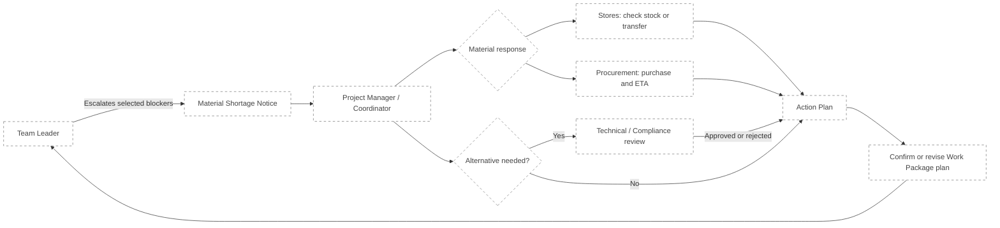

# Future Specification: Material Shortage Notice

## Status and boundary

- **Capability status:** Designed only
- **Evidence status:** Assumptions requiring validation with QAntum
- **Implementation status:** Out of scope for the First Slice

This document describes a credible construction-project extension to
**A2: Readiness + Copy Shortage Summary**. It does not authorize or imply
database tables, migrations, APIs, authentication, UI, notifications, or
placeholder code in the current submission.

## Problem

A copied Shortage Summary helps a Team Leader communicate a problem, but it does
not establish responsibility or provide a decision about the affected work. A
later capability should route the material shortage through the construction
project's management chain and return an actionable plan to the Team Leader.

The business outcome is not “a ticket was created.” It is that the Team Leader
knows whether the crew should attend site, wait for materials, use an approved
alternative, or follow a revised work plan.

## Assumed project roles

The brief does not define the following responsibility model. For future design
purposes, this specification makes these explicit assumptions:

1. Every Work Package belongs to a Project.
2. Every Project has a nominated Project Manager or Project Coordinator.
3. The Team Leader leads a field installation crew and raises a material
   shortage against planned work.
4. The Project Manager is accountable for coordinating a response, but may
   delegate individual actions.
5. Stores or Procurement confirms availability, transfer options, purchasing,
   and expected delivery dates.
6. A Technical or Compliance Reviewer independently evaluates any proposed
   Alternative Solution.
7. Project roles, membership, and access rights come from an existing identity
   and project-management model that is not defined by this exercise.

These assumptions must be validated before implementation. Role names may vary
between organisations; the invariant is the separation of field reporting,
project coordination, material fulfilment, and technical approval.

## Canonical language

- **Escalate material shortage:** the Team Leader action that creates a durable
  Material Shortage Notice.
- **Material Shortage Notice:** the persistent project record describing
  affected planned work and its material evidence.
- **Action Plan:** the confirmed project response that tells the Team Leader how
  the work will proceed.

`Escalation` is not used as a generic stored entity. It describes the business
action; the domain record has the more specific construction meaning above.

## Assumed future workflow



The Project Manager is the coordination owner, not necessarily the person who
performs procurement or technical review. Procurement is not the sole recipient
because a shortage may be resolved by transfer, rescheduling, or an approved
alternative.

## Assumed lifecycle

```text
RAISED -> REVIEWING -> ACTION_CONFIRMED -> CLOSED
```

- `RAISED`: submitted and routed to the Work Package's Project Manager.
- `REVIEWING`: responsibility has been acknowledged and one or more response
  paths are being investigated.
- `ACTION_CONFIRMED`: the Project Manager has communicated a concrete Action
  Plan to the Team Leader.
- `CLOSED`: the decision has been acted on or the affected work is no longer
  planned.

Cancellation and reopening rules remain open questions. Alternative-Solution
approval has its own lifecycle and must not be hidden inside these statuses.

## Conceptual information model

A future Material Shortage Notice would conceptually require:

- Project and Work Package identity;
- raising Team Leader and accountable Project Manager;
- selected Blocking Requirements;
- an immutable snapshot of the submitted material evidence;
- optional Team Leader context;
- current lifecycle status;
- assignments or requested actions for Stores, Procurement, or reviewers;
- Action Plan and material ETA when applicable;
- status and decision history for auditability.

This is a conceptual model, not a database schema. Field types, table boundaries,
RLS policies, APIs, and events must be designed only after the assumed project
and identity contracts are confirmed.

## Relationship to Material Readiness

- Material Readiness remains the authority for `READY`, `SHORTAGE`, and
  `UNKNOWN` calculations.
- The Notice consumes selected readiness evidence; it does not implement a
  second readiness algorithm.
- Submitted evidence is preserved for audit context.
- Before closing or treating the Work Package as ready, the system reads current
  inventory evidence again. An old snapshot cannot prove current readiness.
- An approved Alternative Solution changes the planned Solution through its own
  controlled workflow; a catalogue match alone is not approval.

## Conceptual outcomes

An Action Plan may record one or more of these outcomes:

- transfer available material from an agreed location or Project;
- purchase material and communicate an expected delivery date;
- wait for replenishment;
- submit an Alternative Solution for independent approval;
- revise the Work Package or crew schedule;
- cancel the affected planned work.

The Team Leader must receive a concrete decision that can change the visit or
crew plan. A notification without an Action Plan is not resolution.

## Future security and reliability requirements

- Only a Team Leader with access to the Project may raise a Notice for its Work
  Package.
- Project Managers see and coordinate Notices for Projects they manage.
- Stores, Procurement, and reviewers receive only the access needed for their
  assigned actions.
- Creating the Notice and its evidence snapshot must be atomic.
- Notification occurs after durable creation; notification failure must not
  discard the Notice.
- Audit history identifies who changed responsibility, status, approval, or the
  Action Plan.
- Duplicate active Notices for the same Blocking Requirement require an
  explicit prevention or merge rule.

These are future requirements, not claims about the public A2 demo.

## Open questions requiring validation

1. What are QAntum customers' actual role names and responsibility boundaries?
2. Is the accountable recipient always a Project Manager, or configurable per
   Project or contractor?
3. Which existing system owns Project membership and Work Package assignment?
4. Where do trustworthy warehouse, reservation, transfer, and ETA data come
   from?
5. Which roles may propose, review, and approve an Alternative Solution?
6. What evidence and audit retention are required for the golden thread?
7. What constitutes closure: an Action Plan, material receipt, schedule change,
   or confirmed Work Package readiness?
8. How should concurrent or repeated shortages for the same requirement be
   combined?

## Trigger for implementation

Implementation may be planned only after QAntum validates the role/routing
model, source systems, authorization boundary, lifecycle ownership, and closure
definition. Until then, A2 remains deliberately limited to a transparent,
copyable Shortage Summary.
