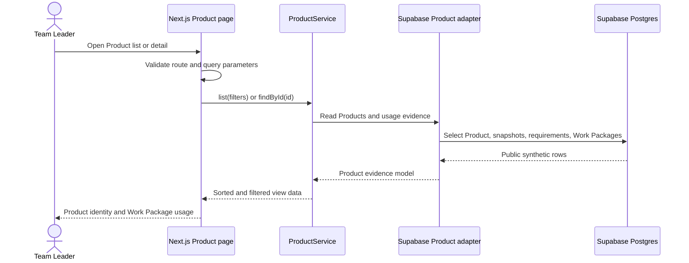

# Read-only Product Explorer Specification

## Metadata

- Status: Approved
- Approved: Yes, by the user on 2026-10-02
- Iterations: 1
- Last updated: 2026-10-03
- Repository: `passivefire`
- Domain: Product catalogue and Work Package evidence
- Related First Slice: [Material Readiness](material-readiness.md)

## Summary

Add a public, read-only Product Explorer so a Team Leader can inspect a specific
Product and see which Work Packages reference it. The explorer makes the
existing Product model and reverse usage relationship visible without creating
a Product administration system or presenting the synthetic SolutionProduct
association as an approved bill of materials, site, warehouse, reservation, or
compliance decision.

This is a supporting demonstration capability, not part of the accepted A2
Readiness + Copy Shortage Summary boundary.

## User and outcome

**Primary persona:** Team Leader reviewing material evidence before travelling
to site.

**Desired outcome:** move from a Product shown in a Work Package to stable
Product identity and profile information, with latest Inventory evidence and
the Work Packages that reference it grouped in a secondary usage view where
available and required quantities can be understood together.

Success is observable when the user can navigate both directions without
confusing Work Package usage with a physical location, formal Solution bill of
materials, stock reservation, or compliance approval.

## Scope

### In scope

- A Product list at `/products`.
- A Product detail page at `/products/[id]`.
- One clear Product-detail link from mapped Product evidence in Work Package
  detail, using the Product name while retaining Product Code as adjacent
  evidence.
- Product identity and profile: name, Product Code, category, manufacturer,
  Supplier Product Code, Product Variant, description, and canonical unit.
- Latest Inventory Snapshot evidence selected deterministically by
  `captured_at DESC, id DESC`.
- Reverse usage through
  `Product -> SolutionProduct -> Product Requirement -> Solution Option -> Work Package`,
  showing Work Package name, planned date, requirement description, and
  required quantity for current selected options only.
- Informational required quantity across the usage rows. Known quantities are
  summed, while requirements without a quantity are reported separately and
  never discarded or treated as zero.
- Product search by name or Product Code.
- Product filters for usage evidence and Inventory Snapshot evidence.
- Shared navigation, page-heading, and empty/no-results UI components where a
  second concrete consumer exists.
- Loading, not-found, dependency-error, empty, and filtered-empty states that do
  not imply inventory or readiness conclusions.

### Out of scope

- Product create, update, delete, import, or bulk administration.
- Authentication, authorization, tenancy, or role-based Product management.
- Solution list/detail routes or formal bill-of-materials presentation.
- Category hierarchy or administration, supplier management, pricing,
  specification documents, approvals, or compliance claims.
- Site, building, level, zone, warehouse, bin, or physical-location semantics.
- Inventory editing, reservation, allocation, transfer, ordering, or history UI.
- An automatic Product-wide readiness, shortage, remaining-stock, or allocation
  result across all Work Packages. The informational total does not assume the
  Work Packages run together; explicit selected-Work-Package comparison remains
  owned by Material Readiness.
- Pagination, client-side caching, or a generic configurable table framework.

## Deferred ideas

- Solution Explorer after Solution ownership and Product mapping are defined.
- Direct Solution bill of materials after a trusted source and approval model
  exist.
- Product administration after identity, authorization, audit, validation, and
  tenant ownership are known.
- Inventory locations and reservation-aware availability.

## Canonical relationship and wording

The delivered relationship is:

```text
Product
  <- SolutionProduct
      <- Product Requirement
          <- selected Solution Option
              <- Work Package
```

The secondary section is labelled **Work Package usage (n)**. Its table is
accessible as **Work Package usage** and must not say "locations", "sites",
"approved Solutions", or "required by this Solution". A Product's presence in
Work Package evidence is not approval for the nominated Solution.

## Routes and interaction

### `/products`

Each Product result shows:

- Product name;
- Product Code;
- canonical unit;
- latest available quantity and capture time, or `Unknown`;
- number of referencing Work Packages.

Results use a table with visible column headings on wider screens and labelled
stacked fields on narrow screens. Each result exposes one Product-detail link
whose pointer target covers the complete visual row.

The default order is Product Code ascending, then Product ID ascending.

The GET query contract is:

- `q`: trimmed text, maximum 100 characters, case-insensitive match against
  Product name or Product Code;
- `usage`: `all`, `used`, or `unused`, default `all`;
- `inventory`: `all`, `known`, or `unknown`, default `all`.

Controls use a semantic GET search form so state is represented in the URL and
survives refresh, back/forward navigation, and link sharing. Invalid enum values
fall back to `all`; an invalid or overlong search value falls back to an empty
query. No JavaScript-only filtering or pagination is required for six
Products.

The unfiltered empty state says no Products are available. A filtered-empty
state says no Products match the current search and filters and offers a clear
reset action. Neither state claims readiness or zero inventory.

### `/products/[id]`

The route validates the Product ID before querying. A missing or malformed ID
shows the application not-found treatment.

The page shows:

1. Persistent Product identity: name and Product Code.
2. A **Product details** tab, selected by default, containing description,
   Product Category, Manufacturer, Supplier Product Code, Product Variant, and
   canonical unit.
3. A secondary **Work Package usage (n)** tab containing the latest Inventory
   Snapshot once—available quantity and captured time, or an explicit `Unknown`
   evidence state—and the total required quantity across all listed Product
   Requirements, followed directly by a semantic table with one row per
   referencing Product Requirement. The summary preserves the known quantity
   total and separately counts requirements with an unknown quantity. An
   incomplete subtotal is labelled **Known required**, and is `Unknown` when no
   requirement quantity is known; `0` is shown only when there are no usage
   rows. Rows are ordered by Work Package planned date, Work Package name,
   requirement position, and requirement ID.

The selected section is represented in the URL. Product details uses the clean
`/products/[id]` URL; Work Package usage uses `?tab=usage`. Missing, repeated,
or unsupported `tab` values fall back to Product details. The controls are
navigation links styled as tabs, rather than a client-only ARIA tab widget, so
refresh, sharing, back/forward navigation, and native link keyboard behaviour
remain available without hydration.

Each usage row shows the Work Package name as a link whose hit area covers the
visual row, planned date, requirement description, and required quantity in the
Product's canonical unit. Product-level available and total required quantities
are not repeated per row. The view does not calculate remaining stock or expose
SolutionProduct as navigation or infer compliance approval. The tab label is
the only visible usage count and counts unique Work Packages, not requirement
rows; duplicate section headings are omitted. A concise visible note states that
the summary does not reserve stock or assume concurrent work.

### Work Package detail

A mapped Product name is the single clear link to the Product detail page;
Product Code remains adjacent identity evidence rather than a duplicate link.
Unknown Product evidence remains plain `Unknown` and is never linked.

## Component boundaries and reuse

Cross-capability components live under `src/components` only after they have at
least two real consumers:

- `AppNavigation`: Work Packages and Products destinations with an accessible
  current-page treatment. Work Packages continues to target the existing `/`
  list; Products targets `/products`. This task does not relocate the existing
  Work Package list route.
- `PageHeading`: shared title, eyebrow, and supporting-copy structure.
- `EmptyState`: shared semantic container with domain-specific copy and optional
  recovery link.
- `Breadcrumbs`: shared list-to-detail orientation for Product and Work Package
  pages. The parent is a link and the current record is non-interactive.

Product-specific controls and views stay under `src/modules/product`:

- `ProductListControls` owns the Product query contract and labels.
- `ProductList` and `ProductListItem` render Product discovery results.
- `ProductDetail` renders persistent identity, section navigation, and the
  selected profile or usage view.
- `ProductUsageList` derives the informational total required quantity, renders
  it beside one latest Inventory evidence summary, and renders the reverse Work
  Package relationship table.

Do not introduce a universal card, table, form-builder, or configuration-driven
entity renderer. Readiness status components remain owned by the Readiness
module.

## Data and control flow



The Product module uses a narrow `ProductRepository` with `list()` and
`findById(id)`. `ProductService` applies deterministic search/filter behavior.
The Supabase adapter owns row translation and latest-snapshot selection. The
Product table carries a flat profile and the seed supplies independently
authored synthetic values; neither reuses fields from the supplied Solution
catalogue.

## Assumptions and constraints

- [x] Product identity and canonical unit exist in the current schema
      (validated).
- [x] Product profile fields are independently authored synthetic data and do
      not come from the supplied Solution catalogue (validated).
- [x] Product usage can be traced through Product Requirements to Work Packages
      (validated).
- [x] The public role already has read-only access to the required tables and no
      runtime write permission (validated).
- [x] The README and reviewer documentation identify the application as a
      read-only demo; the UI does not require a persistent demo badge, and
      synthetic record names remain concise without a `DEMO` identity prefix
      (validated).
- [x] The term "management" means read-only exploration for this task; the user
      approved the written boundary on 2026-10-02.
- The 4–6 hour take-home target remains a constraint. This optional capability
  must not dilute the accepted Shortage Summary, CI, deployment, or verification
  evidence.

## Alternatives and tradeoffs

- **Read-only Product Explorer — selected:** demonstrates relational navigation
  and Product identity using existing public data without inventing security or
  workflow semantics.
- **CRUD Product administration:** rejected because public writes without Auth,
  tenant ownership, validation, and audit would be unsafe and outside A2.
- **Solution and Product catalogue together:** deferred because the current
  association is synthetic and has no authoritative approval or catalogue
  source.
- **Client-only instant filtering:** rejected for now; a GET form is accessible,
  shareable, resilient without hydration, and proportionate to five Products.

## Tasks

1. Product query model and repository boundary
   - Files: `src/modules/product/product-model.ts`,
     `src/modules/product/product-repository.ts`,
     `src/modules/product/product-service.ts`,
     `src/modules/product/supabase-product-repository.ts`, and co-located tests.
   - Action: define Product list/detail evidence, deterministic latest snapshot,
     reverse usage ordering, and pure search/filter behavior using constructor
     injection at the repository boundary.
   - Verify: focused service and adapter tests.
   - Done: known, unknown, unused, zero-quantity, multiple-usage, search, and
     combined-filter cases produce the specified results.

2. Shared navigation and Product pages
   - Files: `src/components/*`, `src/modules/product/*tsx`,
     `src/app/products/page.tsx`, and `src/app/products/[id]/page.tsx`.
   - Action: add only proven shared components, semantic GET controls, Product
     list/detail views, and complete empty/not-found/error states.
   - Verify: presentation tests plus rendered desktop and narrow-width review.
   - Done: all Product fields and states are readable, keyboard operable, and
     linked without Solution/location claims.

3. Readiness integration and verification
   - Files: `src/modules/readiness/work-package-detail.tsx`, documentation, and
     the selected PF-006 browser journey.
   - Action: link known Product evidence to Product detail, link Product usage
     back to Work Packages, update capability status and test strategy, then run
     the complete quality gate and runtime checks against local Supabase.
   - Verify: focused component tests, `npm run check`, runtime list/detail curls,
     and manual keyboard/mobile review.
   - Done: bidirectional navigation and filtering work against synthetic data
     without changing readiness results.

## Test strategy

- Unit: Product query parsing, case-insensitive search, usage/inventory filters,
  deterministic ordering, and filter combinations.
- Adapter: latest-snapshot selection, numeric zero, missing snapshot, no usages,
  and multiple requirements across Work Packages.
- Presentation: product links, identity, known/unknown evidence, total required
  aggregation, usage list, unfiltered empty state, filtered-empty state, and
  reset action.
- Runtime: list returns all five Products; Product detail returns its
  latest snapshot and linked Work Packages; malformed/missing ID shows not-found.
- E2E: PF-006 may extend its one journey with Work Package -> Product -> Work
  Package navigation rather than adding a separate broad browser suite.

## Definition of Done

### Feature criteria

- [ ] `/products` lists all five Products in deterministic order.
- [ ] Search and filters follow the documented URL contract and expose a useful
      filtered-empty recovery state.
- [ ] `/products/[id]` prioritises Product identity and profile information by
      default, with latest Inventory evidence and every referencing Work Package
      requirement available through the secondary URL-driven usage tab in
      deterministic order. The usage summary preserves the known total and
      explicitly counts any requirement quantities that remain unknown.
- [ ] Work Package and Product detail pages link to each other for known Product
      evidence.
- [ ] No Product or Solution administration, physical-location, reservation,
      global-readiness, or compliance claim appears.

### Completion checklist

- [ ] Unit, adapter, and presentation tests cover happy, error, and boundary
      cases.
- [ ] Feature is validated against the reset local Supabase environment.
- [ ] `npm run check`, database tests, dependency audit, and diff checks pass.
- [ ] Security, performance, modularity/KISS, and component reuse are reviewed.
- [ ] Documentation and capability status are updated.
- [ ] Keyboard-only and narrow/mobile behavior receive human sign-off.
- [ ] Swagger/OpenAPI is N/A: no HTTP API contract is added.
- [ ] MCP is N/A: no MCP capability is added.

## Risks and mitigations

- **Risk:** usage is mistaken for physical location or formal compatibility.
  **Mitigation:** use the exact **Work Package usage** table label and omit
  Solution aggregation from the Product page.
- **Risk:** latest inventory is mistaken for reserved or globally available
  stock. **Mitigation:** retain the existing synthetic data and no-reservation copy;
  do not calculate Product-level readiness.
- **Risk:** generic component work expands beyond Product Explorer.
  **Mitigation:** extract only components with two concrete consumers and keep
  Product-specific controls inside the Product module.
- **Risk:** optional scope displaces the accepted First Slice.
  **Mitigation:** timebox PF-004A separately and preserve PF-005 through PF-007
  as delivery gates.

## Security considerations

- Data access remains public and read-only through the Supabase publishable key.
- The Product adapter reads only existing synthetic-data tables.
- No Product mutation, privileged function, service-role credential, or browser
  secret is introduced.
- Route and query values are validated with Zod before use.
- Public errors do not reveal database internals.

## Runtime environment

- Start database: `npm run db:start`
- Reset synthetic data: `npm run db:reset`
- Application environment: `NEXT_PUBLIC_SUPABASE_URL` and
  `NEXT_PUBLIC_SUPABASE_PUBLISHABLE_KEY`
- Start app: `npm run dev`
- Focused tests: `npm test -- src/modules/product`
- Complete verification: `npm run check` and `npm run db:test`

## Open questions

- No unresolved behavior question blocks implementation after the user confirms
  this written read-only boundary.

## Decision

Implement Product as a separate, read-only capability module with list/detail
routes, URL-backed search and evidence filters, reverse Work Package usage, and
bidirectional links. Defer Solution pages and all write/admin behavior.
