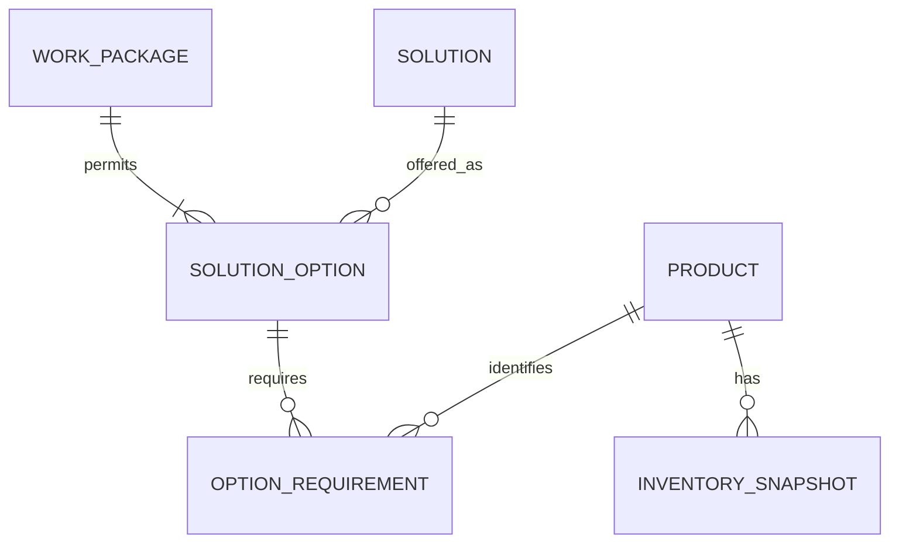

# Scenario Solution Selection

## Status

- **Delivery boundary:** expanded First Slice
- **Capability status:** Implemented and locally verified; hosted delivery pending
- **Implementation work item:** `tasks/PF-004B-solution-selection.md`

This specification extends Material Readiness with one bounded write: a Team
Leader can select an eligible Solution for a Work Package Scenario and
immediately recalculate `READY`, `SHORTAGE`, or `UNKNOWN` from that option's
Product Requirements.

## Confirmed demonstration assumptions

1. One Work Package represents one planned installation Scenario.
2. Anyone may read and preview the public demonstration. Persisting a Selected
   Solution requires a signed-in, pre-provisioned Demo Team Leader account.
   Organisation, Project, work-ownership, and real role authorization remain
   Production Gaps.
3. A Solution row is selectable only when an independently authored Solution
   Option associates it with that Work Package. Association means “eligible for
   this demonstration Scenario”; catalogue-field similarity alone does not
   establish suitability or compliance.
4. Solution rows come from the source-backed catalogue subset. Solution Options,
   Product mappings, and required quantities are synthetic operational
   assumptions because the supplied CSV does not contain them.
5. Each Solution Option owns its Product Requirements. Changing the selected
   option changes the requirement set used by Material Readiness without
   rewriting catalogue data.
6. Inventory retains the existing `availableQuantity` meaning. Selecting a
   Solution does not reserve, allocate, or lock stock.

## User value and boundary

Before travelling to site, the Team Leader can compare eligible ways to deliver
the same planned Scenario and see how each choice changes material readiness.
The selected Solution is persisted so the Work Package list, detail, Product
usage, Aggregate Readiness, and Shortage Summary all use one nominated plan.

This capability does not let the Team Leader approve an arbitrary Alternative
Solution. A Solution not already associated as a Solution Option must follow the
future technical/compliance approval workflow before becoming selectable.

## Primary interaction

1. Open a Work Package.
2. Review its eligible Solution Options and current selected option.
3. Preview each option's Product Requirements and calculated status.
4. Choose `Use this Solution` for one eligible option.
5. If not signed in, authenticate with the privately provided Demo Team Leader
   account and return to the same Work Package decision.
6. The system persists that option as the selected Solution.
7. The detail page, list status, Product usage, Aggregate Readiness, and any
   Shortage Summary use the newly selected option.
8. If the session has expired, the write fails, or a concurrent write makes the
   request stale, the prior selection remains and the UI reloads current
   evidence.

Public preview does not require a session. Sign-in, sign-out, session recovery,
and the write gate are part of this extension; self-service sign-up, password
recovery, user administration, and production RBAC are not.

## Status and quantity rules

The existing status contract remains unchanged:

- `UNKNOWN`: Product mapping, required quantity, or Inventory Snapshot is
  missing.
- `SHORTAGE`: known `availableQuantity < requiredQuantity`.
- `READY`: every requirement is known and
  `availableQuantity >= requiredQuantity`.

At Work Package level, `SHORTAGE` continues to take precedence over `UNKNOWN`,
which takes precedence over `READY`. Product quantities use the Product's
canonical unit and scale-three decimal semantics.

`READY` means only that current evidence is sufficient when the Work Package is
considered on its own. It does not mean inventory has been secured. Aggregate
Readiness remains the only current check for combined selected Work Package
demand.

## Conceptual data model



- `SolutionOption`: one source-backed Solution explicitly made eligible for one
  Work Package Scenario.
- `OptionRequirement`: the synthetic Product demand for one Solution Option.
- `WorkPackage.selectedSolutionOptionId`: the currently nominated plan.

The model must enforce that the selected option belongs to the same Work
Package. Association presence is the eligibility rule; a second approval status
or generic workflow is unnecessary for this slice.

## Selection command contract

The application exposes one narrow command equivalent to:

```text
selectSolution(workPackageId, solutionOptionId, expectedCurrentOptionId)
```

The command must:

1. require an authenticated Supabase session;
2. validate all IDs at the application boundary;
3. verify the option belongs to the Work Package;
4. compare `expectedCurrentOptionId` to prevent silent lost updates;
5. update only the selected option in one database statement or transaction;
6. be idempotent when the requested option is already selected; and
7. return the selected option ID or a structured failure, then reload the page
   to calculate readiness from current committed evidence.

Direct browser writes to tables remain denied. The anonymous Supabase role may
read the demonstration but cannot execute the selection command. The
authenticated role retains the same read access and may execute only that
constrained command. No service-role key is exposed.

## Failure behaviour

| Condition                            | Result                                                  |
| ------------------------------------ | ------------------------------------------------------- |
| Missing or expired session           | Authentication response; no state change                |
| Unknown option or wrong Work Package | Validation/not-found response; no state change          |
| Option has incomplete evidence       | Selection may persist; resulting status is `UNKNOWN`    |
| Option has insufficient stock        | Selection may persist; resulting status is `SHORTAGE`   |
| Current selection changed meanwhile  | Conflict; prior committed selection remains             |
| Supabase command fails               | Dependency error; no success or changed-selection claim |

Selecting a shortage is allowed because choosing the plan and proving stock are
separate decisions. The UI must show the recalculated status before confirmation
and again after persistence.

## Acceptance criteria

- **SS-1:** every Work Package exposes at least two source-backed Solution
  Options, and only its associated options are selectable.
- **SS-2:** each option has deterministic synthetic Product Requirements with
  canonical-unit quantities.
- **SS-3:** previewing an option calculates the expected `READY`, `SHORTAGE`, or
  `UNKNOWN` result without persisting a change.
- **SS-4:** selecting an eligible option persists it and every dependent view
  reads the same selected option.
- **SS-5:** selecting an unrelated or unknown option is rejected without state
  change.
- **SS-6:** a stale `expectedCurrentOptionId` produces a conflict rather than
  overwriting a newer selection.
- **SS-7:** repeating the current selection is idempotent.
- **SS-8:** failed writes retain the prior selected option.
- **SS-9:** Aggregate Readiness uses requirements from each Work Package's
  current selected option and still counts shared inventory only once.
- **SS-10:** the interface explicitly states that selecting a Solution does not
  reserve stock.
- **SS-11:** direct anonymous and authenticated table insert, update, and delete
  remain denied; only the authenticated constrained command is executable.
- **SS-12:** anonymous visitors can read and preview but cannot persist;
  authenticated visitors can select, sign out, and recover honestly from an
  expired session.
- **SS-13:** keyboard and narrow/mobile users can compare, preview, sign in,
  select, and recover from a conflict.

## Non-functional requirements

- The selection invariant is enforced in Postgres, not only in browser state.
- Domain calculations remain framework-independent and testable without React,
  Next.js, or Supabase.
- Public errors reveal no database internals or credentials.
- Authentication uses request-scoped server session handling. Demo credentials
  are never committed, seeded into public tables, or exposed in client code.
- The mutation accepts only the server-verified session identity and a
  same-origin request; no user ID or role supplied by the browser is trusted.
- The interface communicates eligibility and no-reservation semantics once at
  the decision point rather than repeating warnings on every row.

## Explicit exclusions

- Material reservation, allocation, stock locking, expiry, or release.
- `AVAILABLE` or `RESERVED` statuses.
- Self-service sign-up, password recovery, user/profile administration, MFA,
  multiple roles, tenancy, Project membership, and production authorization.
- Approval of catalogue Solutions not already associated as Solution Options.
- Multiple supply locations, transfers, incoming stock, delivery dates, safety
  stock, packaging, or unit conversion.
- Crew scheduling and Material Shortage Notice delivery.

## Auth risks and mitigations

| Risk                                                   | Mitigation                                                                 |
| ------------------------------------------------------ | -------------------------------------------------------------------------- |
| Authentication is mistaken for production RBAC         | Label the account Demo Team Leader; keep production roles out              |
| Signing in removes access to public evidence           | Grant identical SELECT policies to anon and authenticated roles            |
| Browser supplies a forged identity or cross-site write | Resolve identity server-side and require same-origin mutation              |
| Session expires between preview and confirmation       | Recheck on every write; preserve selection and prompt sign-in              |
| Shared demo state drifts between reviewer visits       | Limit writes to reversible eligible options; reset before tests            |
| Credentials enter repository or public artifacts       | Provision outside Git; use ignored local env or masked ephemeral CI output |
